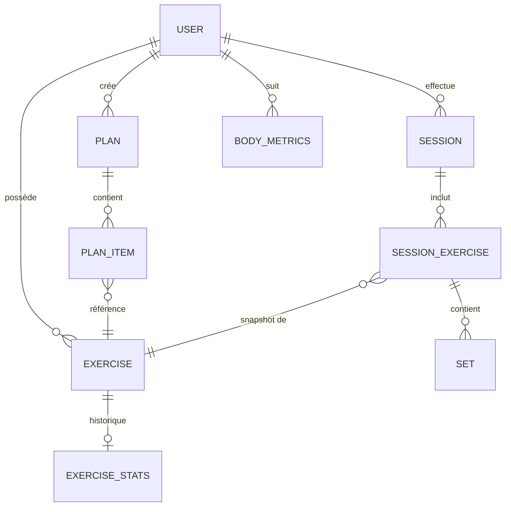

# 🏋️‍♂️ Architecture de la Base de Données (NoSQL)

## 👤 1. Les Fondations (Profil & Catalogue)
Données structurelles et statiques.

* **`users/{uid}`** (Profil de l'utilisateur)
    * `displayName` : "Valentin"
    * `email` : "valentin@email.com"
    * `defaultRestSec` : 90
    * `createdAt` : "2026-03-01T10:00:00Z"

* **`exercises/{exerciseId}`** (Bibliothèque de référence)
    * `name` : "Développé Couché"
    * `category` : "push"
    * `trackingMode` : "weight_reps"
    * `defaultSets` : 4 | `defaultRestSec` : 120
    * `isActive` : true

## 📋 2. Les Modèles d'Entraînement (Templates)
Les programmes préparés à l'avance.

* **`plans/{planId}`** (Le conteneur)
    * `name` : "Keep Cool - Full Body"
    * `gymName` : "Keep Cool Prado"
    * `isActive` : true

* **`plans/{planId}/items/{itemId}`** (Le contenu séquentiel)
    * `order` : 1
    * `exerciseId` : "ex_benchpress_01"
    * `targetSets` : 4 | `targetReps` : 10 | `targetWeightKg` : 65
    * `restSec` : 120

## 🏋️‍♂️ 3. Le Cœur de l'Action (Tracking en direct)
L'instance unique d'une séance. On ne touche plus aux modèles.

* **`activeSession/current`** (Pointeur UX d'état)
    * `sessionId` : "sess_lundi_03_mars"
    * `activeExerciseId` : "sess_ex_benchpress"
    * `activeSetNumber` : 2
    * `restEndsAt` : "2026-03-03T18:15:30Z"

* **`sessions/{sessionId}`** (L'enveloppe de la séance)
    * `planId` : "plan_keepcool_fb"
    * `status` : "active"
    * `startedAt` : "2026-03-03T18:00:00Z"

* **`sessions/{sessionId}/exercises/{sessionExerciseId}`** (Le snapshot de l'exercice)
    * `exerciseId` : "ex_benchpress_01"
    * `exerciseNameSnapshot` : "Développé Couché"
    * `totalVolumeKg` : 2600
    * `startedAt` : "2026-03-03T18:05:00Z"

* **`.../sets/{setId}`** (Validation de la série)
    * `setNumber` : 1
    * `reps` : 10 | `weightKg` : 65
    * `restStartAt` : "2026-03-03T18:05:45Z"
    * `rpe` : 8

## 📈 4. L'Évolution (Dashboard)
Collections plates pour les graphiques.

* **`exerciseStats/{exerciseId}`** (Palmarès du mouvement)
    * `bestWeightKg` : 80 | `bestEstimated1RM` : 95
    * `totalSessions` : 42

* **`bodyMetrics/{entryId}`** (Évolution corporelle)
    * `measuredAt` : "2026-03-01T08:00:00Z"
    * `weightKg` : 78.5 | `bodyFatPct` : 16.2

* **`progressPhotos/{photoId}`** (Photos d'évolution)
    * `storagePath` : "users/uid/photos/2026_03_01_face.jpg"
    * `weightKgSnapshot` : 78.5

